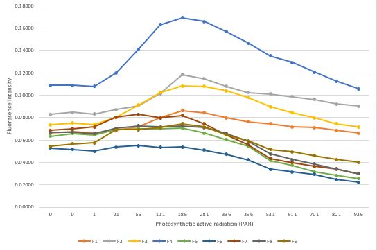
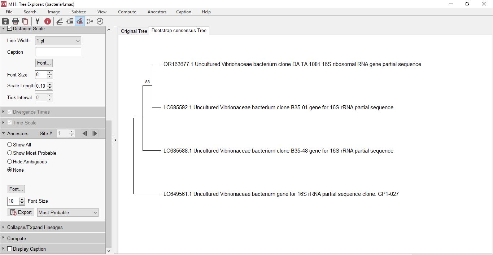
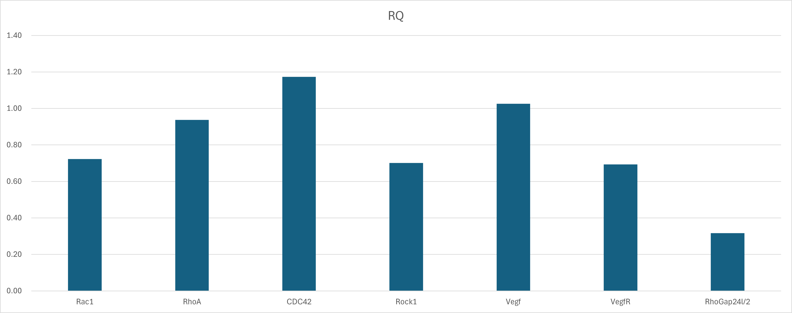
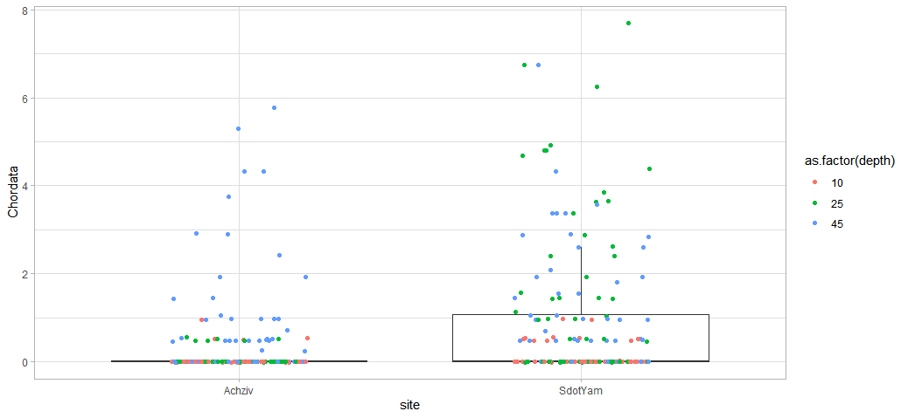
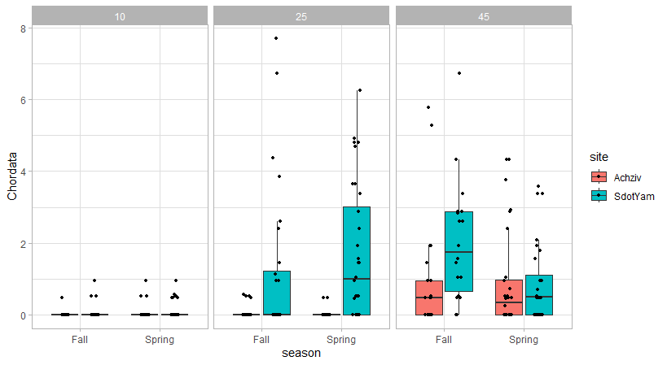
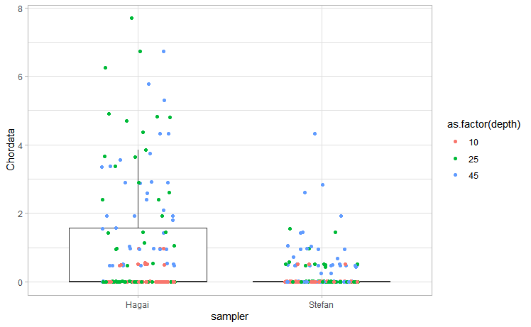
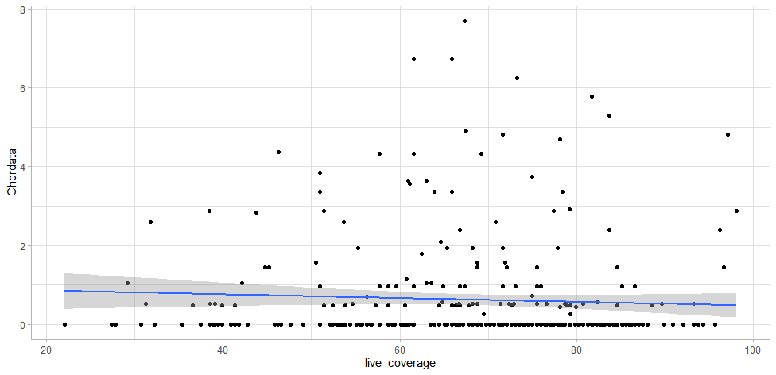
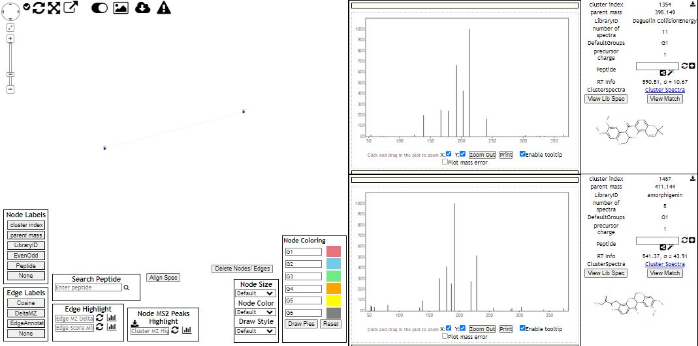

# Results Document 
## 2024-05-23
We watched and did an initial evaluation of PAM imaging of our *Padina pavonica* samples. PAM (Pulse Amplitude Modulation) machines provide information on the light reactions of photosynthesis and indirect information about the functioning of the Calvin cycle or ATP status. In our case, we used it to measure chlorophyll fluorescence by exposing our algae samples to bright flashes of light periodically. The resulting fluorescence response was measured, with noticeable declines after especially strong exposure to light signifying overexposure.

**Image 1.** Chosen fields on the *Padina pavonica* samples in a PAM machine interface

### Part 4 - Example results

| #  | Date-Time (Israel Daylight Time) | Ch:1 - Temperature   (°C) | Ch:2 - Light   (lux) |
| -- | -------------------------------- | ------------------------- | -------------------- |
| 81 | 05/23/2024 11:20:00              | 26.25                     | 7421.44              |
| 82 | 05/23/2024 11:21:00              | 26.38                     | 4953.60              |
| 83 | 05/23/2024 11:22:00              | 26.12                     | 0.00                 |
| 84 | 05/23/2024 11:23:00              | 27.24                     | 38338.56             |
| 85 | 05/23/2024 11:24:00              | 26.77                     | 25487.36             |
| 86 | 05/23/2024 11:25:00              | 27.07                     | 47452.16             |

**Fig 1.** Example of HOBO °C and lux data

| Date       | Time       | No. | PAR | F1     | F2     | F3     | F4     | F5     | F6     | F7     | F8     | F9     |
| ---------- | ---------- | --- | --- | ------ | ------ | ------ | ------ | ------ | ------ | ------ | ------ | ------ |
| 23/05/2024 | 1:50:06 PM | 1   | 0   | 0.0662 | 0.0828 | 0.0735 | 0.1088 | 0.0632 | 0.0529 | 0.0686 | 0.0667 | 0.0544 |
| 23/05/2024 | 1:52:22 PM | 2   | 0   | 0.0676 | 0.0848 | 0.075  | 0.1088 | 0.0657 | 0.0515 | 0.0701 | 0.0672 | 0.0564 |
| 23/05/2024 | 1:55:26 PM | 3   | 1   | 0.0662 | 0.0833 | 0.074  | 0.1078 | 0.0647 | 0.05   | 0.0716 | 0.0657 | 0.0574 |
| 23/05/2024 | 1:58:28 PM | 4   | 21  | 0.0686 | 0.0873 | 0.0804 | 0.1201 | 0.0691 | 0.0539 | 0.0804 | 0.0706 | 0.0691 |
| 23/05/2024 | 2:01:31 PM | 5   | 56  | 0.0716 | 0.0907 | 0.0912 | 0.1412 | 0.0701 | 0.0549 | 0.0828 | 0.0725 | 0.0691 |
| 23/05/2024 | 2:04:33 PM | 6   | 111 | 0.0799 | 0.1015 | 0.1025 | 0.1632 | 0.0701 | 0.0534 | 0.0799 | 0.0716 | 0.0711 |
| 23/05/2024 | 2:07:36 PM | 7   | 186 | 0.0863 | 0.1186 | 0.1083 | 0.1691 | 0.0706 | 0.0539 | 0.0819 | 0.0725 | 0.0745 |
| 23/05/2024 | 2:10:38 PM | 8   | 281 | 0.0843 | 0.1147 | 0.1078 | 0.1657 | 0.0662 | 0.051  | 0.0745 | 0.0711 | 0.0716 |
| 23/05/2024 | 2:13:41 PM | 9   | 336 | 0.0799 | 0.1078 | 0.1039 | 0.1569 | 0.0603 | 0.0471 | 0.0647 | 0.0657 | 0.0647 |
| 23/05/2024 | 2:16:43 PM | 10  | 396 | 0.0765 | 0.1025 | 0.098  | 0.1466 | 0.0544 | 0.0422 | 0.0559 | 0.0588 | 0.0593 |
| 23/05/2024 | 2:19:46 PM | 11  | 461 | 0.0515 | 0.0701 | 0.0632 | 0.0941 | 0.0338 | 0.026  | 0.0343 | 0.0353 | 0.0382 |
| 23/05/2024 | 2:22:49 PM | 12  | 531 | 0.0745 | 0.101  | 0.0897 | 0.1353 | 0.0417 | 0.0338 | 0.0436 | 0.0475 | 0.0515 |
| 23/05/2024 | 2:25:51 PM | 13  | 611 | 0.0716 | 0.0985 | 0.0843 | 0.1294 | 0.0373 | 0.0314 | 0.0397 | 0.0426 | 0.0495 |
| 23/05/2024 | 2:28:54 PM | 14  | 701 | 0.0711 | 0.0961 | 0.0799 | 0.1206 | 0.0314 | 0.0294 | 0.0363 | 0.0387 | 0.0461 |
| 23/05/2024 | 2:31:56 PM | 15  | 801 | 0.0686 | 0.0922 | 0.0745 | 0.1127 | 0.0284 | 0.0245 | 0.0343 | 0.0338 | 0.0426 |
| 23/05/2024 | 2:34:59 PM | 16  | 926 | 0.0662 | 0.0902 | 0.0716 | 0.1059 | 0.0255 | 0.0221 | 0.0299 | 0.0299 | 0.0402 |

**Fig 2.** Example of our PAM imaging data. "Par" - strength of light-flash. F1-F9 - specific spots chosen on an algae sample, their fluorescence response

**Fig 3.** Fluorescence intensity chart

## 2024-06-13

### Preliminary results of sample extractions 

| Sample ID | #order | Fish sp. | Tissue box name | Date of collection | Date of necropsy | Length | Weight | Organ | 
| ----------- | ----------- | ----------- | ----------- | ----------- | ----------- | ----------- | ----------- | ----------- |
| 23.12.27.28.Gi | 182 | Decapterus russelli  | Fedor Box 1 | 6.12.23 | 27.12.23 | 20   | 85.8  | Gills |
| 23.12.27.29.Gi | 183 | Decapterus russelli  | Fedor Box 1 | 6.12.23 | 27.12.23 | 20.5 | 96.2  | Gills |
| 23.12.27.30.Gi | 184 | Decapterus russelli  | Fedor Box 1 | 6.12.23 | 27.12.23 | 21.5 | 91.1  | Gills |
| 10.01.24.1.GI  | 185 | Saurida lessepsianus | Fedor Box 2 | 6.12.23 | 10.01.24 | 31.9 | 213.3 | Gills |
| 10.01.24.2.GI  | 186 | Saurida lessepsianus | Fedor Box 2 | 6.12.23 | 10.01.24 | 25   | 95.9  | Gills |
| 10.01.24.3.GI  | 187 | Saurida lessepsianus | Fedor Box 2 | 6.12.23 | 10.01.24 | 24.4 | 97    | Gills |

Table 1 - An example table of 6 datapoints from the extractions made at the end of 2023 and the beginning of 2024.

## 2024-06-20

### Step 1
Because my work isn't based on a single species, but instead looks for a variety of bacterial pathogens and parasites in polled DNA from fish species, Ill attempt to design a primer for one of the most commonly encountered fish pathogens - [*Vibrionaceae*](https://en.wikipedia.org/wiki/Vibrionaceae).

First, I found 4 16S gene sequences of different strains (species not identified) for the bacteria, and used Multiple Sequence Alignment by [CLUSTALW](https://www.genome.jp/tools-bin/clustalw). Getting a conservative region approximately 200-300 bp in length. 
### Step 2
Then, we need to create primers, for this I will paste the most conservative region in the [Primer3 tool](https://primer3.ut.ee/)

|              | start | len | tm    | gc% | any_th | 3'th | hairpin | seq                  |
| ------------ | ----- | --- | ----- | --- | ------ | ---- | ------- | -------------------- |
| Left Primer  | 68    | 20  | 59.01 | 55  | 0      | 1.02 | 0       | GTCGTAAAGCTCTGTCGCAG |
| Right Primer | 286   | 20  | 59.2  | 55  | 0      | 0    | 0       | TCTCCGACACTCAAGCTACG |

**Fig.1** - results of using the primer tool.

### Step 3 
After, we worked on creating a phylogenetic tree in [MEGA](https://www.megasoftware.net/home). A bootstrap consensus version tree was constructed. 

**Fig.2** - bootstrap consensus tree of the 4 chosen *Vibrionaceae* strains. 

## 2024-07-04

Today we calculated different values that we would get from the qPCR.
### Ct (Cycle Threshold) Values
The Ct value is the number of cycles required for the fluorescent signal to exceed the background level. It is inversely proportional to the amount of target nucleic acid in the sample; lower Ct values indicate higher amounts of target nucleic acid.

|                      | ubi   | Rac1  | RhoA  | CDC42 | Rock1 | Vegf  | VegfR | RhoGap24l/2 |
| -------------------- | ----- | ----- | ----- | ----- | ----- | ----- | ----- | ----------- |
| DMSO Control         | 20.72 | 25.65 | 29.13 | 28.45 | 28.28 | 29.71 | 28.61 | 29.48       |
| Inhibtior treartment | 19.89 | 25.34 | 28.41 | 27.38 | 28.01 | 28.85 | 28.36 | 30.45       |

**Fig. 1** - Cycle Threshold values (Ct)

### ΔCt (Delta Ct) Values
ΔCt is the difference between the Ct value of the target gene and the Ct value of a reference gene (housekeeping gene). This normalization accounts for variations in the amount of starting material and efficiency of the PCR reaction.

|                      | Rac1 | RhoA | CDC42 | Rock1 | Vegf | VegfR | RhoGap24l/2 |
| -------------------- | ---- | ---- | ----- | ----- | ---- | ----- | ----------- |
| DMSO Control         | 4.94 | 8.41 | 7.73  | 7.56  | 8.99 | 7.90  | 8.76        |
| Inhibtior treartment | 5.44 | 8.51 | 7.48  | 8.11  | 8.95 | 8.47  | 10.56       |

**Fig. 2** - Delta Cycle Threshold (Ct)

### ΔΔCt (Delta Delta Ct) Values
ΔΔCt is the difference between the ΔCt of the experimental sample and the ΔCt of the control sample. This comparative method allows for the calculation of relative gene expression levels.

| Genes | Rac1 | RhoA | CDC42  | Rock1 | Vegf   | VegfR | RhoGap24l/2 |
| ----- | ---- | ---- | ------ | ----- | ------ | ----- | ----------- |
| Ct    | 0.51 | 0.10 | \-0.25 | 0.55  | \-0.04 | 0.57  | 1.79        |

**Fig. 3** - Delta Delta Cycle Threshold (Ct)

### Quantification (Absolute or Relative)
Absolute Quantification: Provides the exact number of copies of the target nucleic acid in the sample by comparing Ct values to a standard curve generated from known concentrations of target.

Relative Quantification: Measures changes in gene expression levels relative to a control sample, usually using the ΔΔCt method.

The fold change in gene expression is calculated using the 2^(-ΔΔCt) method.

| Genes | Rac1 | RhoA | CDC42 | Rock1 | Vegf | VegfR | RhoGap24l/2 |
| ----- | ---- | ---- | ----- | ----- | ---- | ----- | ----------- |
| RQ    | 0.72 | 0.94 | 1.17  | 0.70  | 1.03 | 0.69  | 0.32        |

**Fig. 4** - Fold Change 

## 2024-07-12

By using the photosyrvey data, we have earned how to analyze parts of that data in R, and present it in the form of various graphs. As homework, we will repeat those steps, but instead of analyzing live_coverage values, Im choosing a specific taxonomic group, Chordata. 
### Step 1 - lets look at Chordata in relation to site

It seems like from these results, that most Chordata individuals in the Achziv site were found at a 45 m. depth. While the Sdot Yam site is represented mostly by both 45 and 25 m. depths. Another explanation could be the amount of samples available at both sites, less in Achziv and more in Sdot Yam. 

### Step 2 - test homogeneity of variance & difference in coverage levels 
**Homogeneity of variance** 
Bartlett's K-squared = 48.859, df = 1, p-value = 2.75e-12

Since the p-value is far less than any commonly used significance level, this means there is strong evidence to suggest that the variances between the groups are not equal. The variances are heterogeneous.

**Difference in coverage levels**
Kruskal-Wallis chi-squared = 24.62, df = 1, p-value = 6.981e-07

Since the p-value is far less than any commonly used significance level, this means there is strong evidence to suggest that the medians between the groups are not equal - coverage levels are different.

### Step 3 - lets look at Chordata in relation to site and *season*

If we do not take the factor of data availability into account, this data may demonstrate the Chordata is more prevalent during spring at 25 m. depth, and more prevalent during fall at 45 m. depth

### Step 4 - lets examine the sampler 

Interestingly, we can see that one sampler (Hagai), is clearly more successful in collecting Chordata data when compared to his colleague (Stefan)

**Homogeneity of variance** 
Bartlett's K-squared = 196.94, df = 1, p-value < 2.2e-16

Since the p-value is far less than any commonly used significance level, this means there is strong evidence to suggest that the variances between the groups are not equal. The variances are heterogeneous.

**Difference in coverage levels**
Kruskal-Wallis chi-squared = 30.241, df = 1, p-value = 3.816e-08

Since the p-value is far less than any commonly used significance level, this means there is strong evidence to suggest that the medians between the groups are not equal - coverage levels are different.

### Step 5 - lets look at the correlation between live coverage and the Chordata taxonomic group

Judging by our data, the correlation isnt strong, so we cannot assume a strong relationship between live coverage and Chordata.

## Molecular Networks

Link to the job - https://gnps.ucsd.edu/ProteoSAFe/status.jsp?task=fdf6df76a3f14ecdaaa63c850b44f3fc
